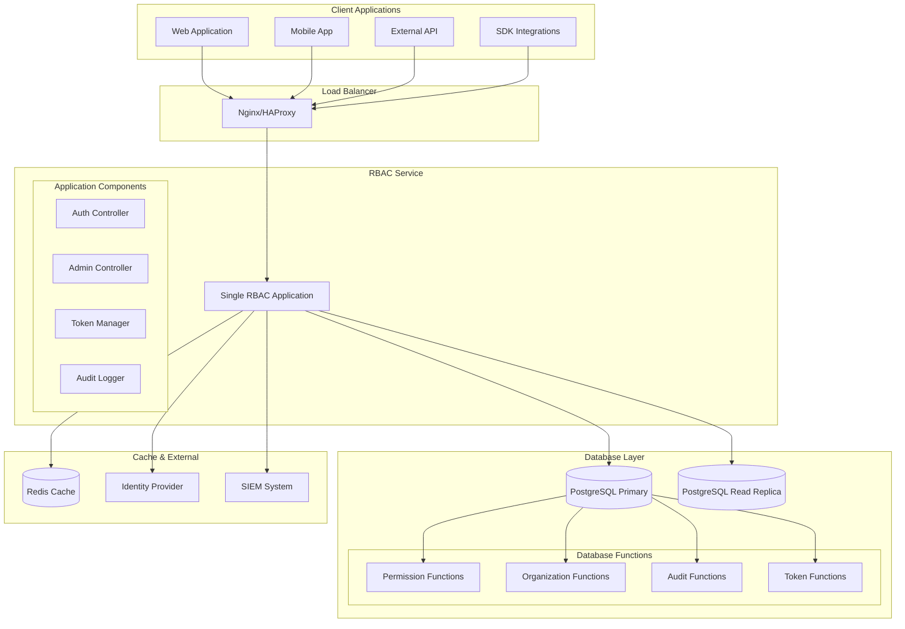
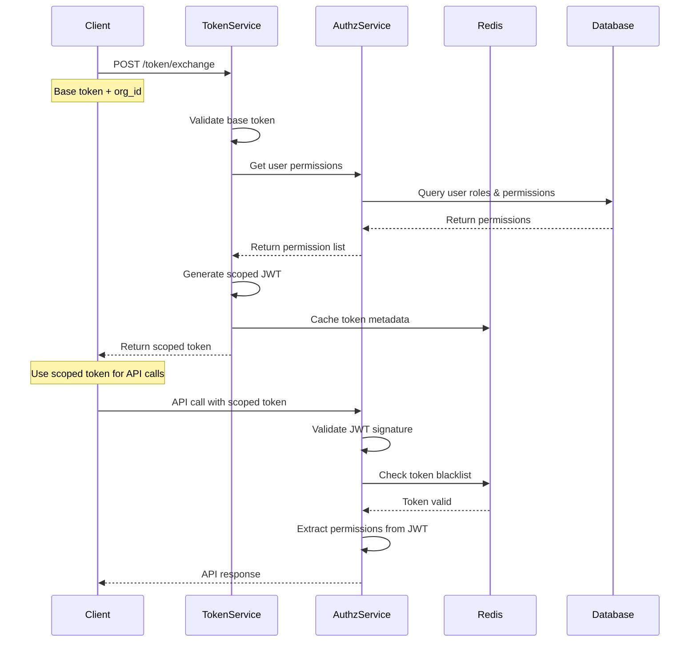

# Multi-Organization RBAC System
## Technical Specifications Document

**Document Version:** 1.0  
**Last Updated:** January 2024  
**Prepared By:** Engineering Team  
**Classification:** Internal Use  

---

## Table of Contents

1. [System Architecture](#system-architecture)
2. [Database Design](#database-design)
3. [API Specifications](#api-specifications)
4. [Authentication & Token Management](#authentication--token-management)
5. [Performance Requirements](#performance-requirements)
6. [Security Implementation](#security-implementation)
7. [Integration Patterns](#integration-patterns)
8. [Deployment Architecture](#deployment-architecture)
9. [Monitoring & Observability](#monitoring--observability)
10. [Error Handling](#error-handling)
11. [Testing Strategy](#testing-strategy)
12. [Operational Procedures](#operational-procedures)

---

## System Architecture

### High-Level Architecture



### Application Layer Design

The application layer is thin and primarily handles HTTP API concerns, with all business logic implemented in PostgreSQL functions.

#### Application Architecture
```csharp
// Main application structure
public class RBACApplication
{
    // Minimal application logic - mainly HTTP handling
    private readonly IDbConnectionFactory _dbFactory;
    private readonly ITokenManager _tokenManager;
    private readonly ICacheManager _cacheManager;
    private readonly IAuditLogger _auditLogger;
    
    public async Task<PermissionCheckResult> CheckPermissionAsync(
        string userId, string orgId, string permission)
    {
        // 1. Validate JWT token
        var tokenClaims = await _tokenManager.ValidateTokenAsync(Request.Headers.Authorization);
        
        // 2. Call database function directly
        using var connection = await _dbFactory.CreateConnectionAsync();
        var result = await connection.QueryFirstAsync<PermissionCheckResult>(@"
            SELECT * FROM authorization.check_user_permission($1, $2, $3, $4)",
            userId, orgId, permission, true);
        
        // 3. Log audit event (database handles the actual logging)
        await _auditLogger.LogPermissionCheckAsync(userId, orgId, permission, result.Allowed);
        
        return result;
    }
}

// Controllers are thin wrappers around database function calls
[ApiController]
[Route("api/v1/[controller]")]
public class AuthorizationController : ControllerBase
{
    private readonly IDbConnection _db;
    
    [HttpGet("check")]
    public async Task<IActionResult> CheckPermission(
        [Required] string permission,
        [FromHeader(Name = "X-Organization-ID")] Guid organizationId)
    {
        var userId = User.FindFirst(ClaimTypes.NameIdentifier)?.Value;
        
        // Direct database function call
        var result = await _db.QueryFirstAsync(@"
            SELECT allowed, source, role_name, expires_at 
            FROM authorization.check_user_permission($1, $2, $3, true)",
            userId, organizationId, permission);
        
        return Ok(result);
    }
    
    [HttpPost("organizations")]
    public async Task<IActionResult> CreateOrganization([FromBody] CreateOrganizationRequest request)
    {
        var userId = User.FindFirst(ClaimTypes.NameIdentifier)?.Value;
        
        // Database function handles all validation and business logic
        var result = await _db.QueryFirstAsync(@"
            SELECT * FROM authorization.create_organization($1, $2, $3, $4, $5, $6)",
            request.Name, request.DisplayName, request.Description, 
            request.ParentId, userId, request.Metadata ?? new {});
        
        return CreatedAtAction(nameof(GetOrganization), new { id = result.Id }, result);
    }
}
```

#### Caching Strategy
```csharp
public class DatabaseCacheService
{
    private readonly IDistributedCache _cache;
    private readonly IDbConnection _db;
    
    public async Task<PermissionCheckResult> CheckPermissionWithCacheAsync(
        string userId, string orgId, string permission)
    {
        // 1. Try cache first
        var cacheKey = $"perm:{userId}:{orgId}:{permission}";
        var cached = await _cache.GetStringAsync(cacheKey);
        
        if (cached != null)
        {
            return JsonSerializer.Deserialize<PermissionCheckResult>(cached);
        }
        
        // 2. Call database function
        var result = await _db.QueryFirstAsync<PermissionCheckResult>(@"
            SELECT * FROM authorization.check_user_permission($1, $2, $3, true)",
            userId, orgId, permission);
        
        // 3. Cache result
        await _cache.SetStringAsync(cacheKey, JsonSerializer.Serialize(result),
            new DistributedCacheEntryOptions { SlidingExpiration = TimeSpan.FromMinutes(15) });
        
        return result;
    }
    
    public async Task InvalidateUserPermissionCacheAsync(string userId, string orgId)
    {
        // Call database function to log invalidation
        await _db.ExecuteAsync(@"
            SELECT authorization.invalidate_user_permission_cache($1, $2)",
            userId, orgId);
        
        // Application handles actual cache clearing
        var pattern = $"perm:{userId}:{orgId}:*";
        await _cache.RemoveByPatternAsync(pattern);
    }
}
```

---

## Database Design

### Schema Structure

```sql
-- Authorization schema namespace
CREATE SCHEMA IF NOT EXISTS authorization;

-- Enable required extensions
CREATE EXTENSION IF NOT EXISTS "uuid-ossp";
CREATE EXTENSION IF NOT EXISTS ltree;
CREATE EXTENSION IF NOT EXISTS pgcrypto;
```

### Core Tables

#### Organizations Table
```sql
CREATE TABLE authorization.organizations (
    id UUID PRIMARY KEY DEFAULT uuid_generate_v4(),
    name VARCHAR(255) NOT NULL,
    display_name VARCHAR(255),
    description TEXT,
    parent_id UUID REFERENCES authorization.organizations(id),
    path LTREE NOT NULL,
    metadata JSONB DEFAULT '{}',
    settings JSONB DEFAULT '{}',
    is_active BOOLEAN DEFAULT true,
    created_at TIMESTAMP WITH TIME ZONE DEFAULT CURRENT_TIMESTAMP,
    updated_at TIMESTAMP WITH TIME ZONE DEFAULT CURRENT_TIMESTAMP,
    created_by UUID,
    updated_by UUID,
    
    -- Constraints
    CONSTRAINT organizations_path_unique UNIQUE(path),
    CONSTRAINT organizations_name_length CHECK(length(name) >= 2),
    CONSTRAINT organizations_no_self_parent CHECK(id != parent_id)
);

-- Indexes for performance
CREATE INDEX idx_orgs_path_gist ON authorization.organizations USING GIST(path);
CREATE INDEX idx_orgs_path_btree ON authorization.organizations USING BTREE(path);
CREATE INDEX idx_orgs_parent_id ON authorization.organizations(parent_id);
CREATE INDEX idx_orgs_active ON authorization.organizations(is_active) WHERE is_active = true;
CREATE INDEX idx_orgs_created_at ON authorization.organizations(created_at);
CREATE INDEX idx_orgs_metadata ON authorization.organizations USING GIN(metadata);
```

#### Users Table
```sql
CREATE TABLE authorization.users (
    id UUID PRIMARY KEY DEFAULT uuid_generate_v4(),
    external_id VARCHAR(255) UNIQUE, -- From identity provider
    email VARCHAR(255) NOT NULL,
    username VARCHAR(100),
    first_name VARCHAR(100),
    last_name VARCHAR(100),
    display_name VARCHAR(200),
    avatar_url TEXT,
    phone VARCHAR(50),
    locale VARCHAR(10) DEFAULT 'en-US',
    timezone VARCHAR(50) DEFAULT 'UTC',
    metadata JSONB DEFAULT '{}',
    preferences JSONB DEFAULT '{}',
    is_active BOOLEAN DEFAULT true,
    is_system_user BOOLEAN DEFAULT false,
    email_verified BOOLEAN DEFAULT false,
    last_login_at TIMESTAMP WITH TIME ZONE,
    password_changed_at TIMESTAMP WITH TIME ZONE,
    created_at TIMESTAMP WITH TIME ZONE DEFAULT CURRENT_TIMESTAMP,
    updated_at TIMESTAMP WITH TIME ZONE DEFAULT CURRENT_TIMESTAMP,
    
    -- Constraints
    CONSTRAINT users_email_unique UNIQUE(email),
    CONSTRAINT users_email_format CHECK(email ~* '^[A-Za-z0-9._%+-]+@[A-Za-z0-9.-]+\.[A-Za-z]{2,}$'),
    CONSTRAINT users_username_format CHECK(username IS NULL OR username ~* '^[a-zA-Z0-9_.-]{3,50}$')
);

-- Indexes
CREATE INDEX idx_users_email ON authorization.users(email);
CREATE INDEX idx_users_external_id ON authorization.users(external_id);
CREATE INDEX idx_users_username ON authorization.users(username);
CREATE INDEX idx_users_active ON authorization.users(is_active) WHERE is_active = true;
CREATE INDEX idx_users_last_login ON authorization.users(last_login_at);
CREATE INDEX idx_users_metadata ON authorization.users USING GIN(metadata);
```

#### Organization Memberships Table
```sql
CREATE TABLE authorization.organization_memberships (
    id UUID PRIMARY KEY DEFAULT uuid_generate_v4(),
    user_id UUID NOT NULL REFERENCES authorization.users(id) ON DELETE CASCADE,
    organization_id UUID NOT NULL REFERENCES authorization.organizations(id) ON DELETE CASCADE,
    status VARCHAR(50) DEFAULT 'active',
    membership_type VARCHAR(50) DEFAULT 'member', -- member, admin, owner
    joined_at TIMESTAMP WITH TIME ZONE DEFAULT CURRENT_TIMESTAMP,
    invited_by UUID REFERENCES authorization.users(id),
    invitation_token VARCHAR(255),
    invitation_expires_at TIMESTAMP WITH TIME ZONE,
    left_at TIMESTAMP WITH TIME ZONE,
    metadata JSONB DEFAULT '{}',
    
    -- Constraints
    CONSTRAINT org_memberships_unique UNIQUE(user_id, organization_id),
    CONSTRAINT org_memberships_status_valid CHECK(status IN ('active', 'inactive', 'pending', 'suspended')),
    CONSTRAINT org_memberships_type_valid CHECK(membership_type IN ('member', 'admin', 'owner', 'guest'))
);

-- Indexes
CREATE INDEX idx_org_memberships_user_id ON authorization.organization_memberships(user_id);
CREATE INDEX idx_org_memberships_org_id ON authorization.organization_memberships(organization_id);
CREATE INDEX idx_org_memberships_status ON authorization.organization_memberships(status);
CREATE INDEX idx_org_memberships_active ON authorization.organization_memberships(user_id, organization_id) 
WHERE status = 'active';
```

#### Roles Table
```sql
CREATE TABLE authorization.roles (
    id UUID PRIMARY KEY DEFAULT uuid_generate_v4(),
    organization_id UUID NOT NULL REFERENCES authorization.organizations(id) ON DELETE CASCADE,
    name VARCHAR(100) NOT NULL,
    display_name VARCHAR(255),
    description TEXT,
    role_type VARCHAR(50) DEFAULT 'custom', -- system, custom, template
    is_inheritable BOOLEAN DEFAULT true,
    is_system_role BOOLEAN DEFAULT false,
    is_assignable BOOLEAN DEFAULT true,
    priority INTEGER DEFAULT 0, -- For role precedence
    color VARCHAR(7), -- Hex color for UI
    metadata JSONB DEFAULT '{}',
    settings JSONB DEFAULT '{}',
    is_active BOOLEAN DEFAULT true,
    created_at TIMESTAMP WITH TIME ZONE DEFAULT CURRENT_TIMESTAMP,
    updated_at TIMESTAMP WITH TIME ZONE DEFAULT CURRENT_TIMESTAMP,
    created_by UUID REFERENCES authorization.users(id),
    updated_by UUID REFERENCES authorization.users(id),
    
    -- Constraints
    CONSTRAINT roles_org_name_unique UNIQUE(organization_id, name),
    CONSTRAINT roles_name_length CHECK(length(name) >= 2),
    CONSTRAINT roles_type_valid CHECK(role_type IN ('system', 'custom', 'template')),
    CONSTRAINT roles_color_format CHECK(color IS NULL OR color ~* '^#[0-9A-Fa-f]{6}$')
);

-- Indexes
CREATE INDEX idx_roles_org_id ON authorization.roles(organization_id);
CREATE INDEX idx_roles_active ON authorization.roles(organization_id, is_active) WHERE is_active = true;
CREATE INDEX idx_roles_inheritable ON authorization.roles(is_inheritable) WHERE is_inheritable = true;
CREATE INDEX idx_roles_system ON authorization.roles(is_system_role) WHERE is_system_role = true;
CREATE INDEX idx_roles_priority ON authorization.roles(priority);
CREATE INDEX idx_roles_metadata ON authorization.roles USING GIN(metadata);
```

#### Permissions Table
```sql
CREATE TABLE authorization.permissions (
    id UUID PRIMARY KEY DEFAULT uuid_generate_v4(),
    permission VARCHAR(255) NOT NULL,
    display_name VARCHAR(255),
    description TEXT,
    category VARCHAR(50) NOT NULL,
    resource VARCHAR(100), -- Extracted from permission string
    action VARCHAR(100),   -- Extracted from permission string
    scope VARCHAR(50) DEFAULT 'organization', -- organization, system, global
    is_system_permission BOOLEAN DEFAULT false,
    is_dangerous BOOLEAN DEFAULT false, -- Requires additional confirmation
    metadata JSONB DEFAULT '{}',
    created_at TIMESTAMP WITH TIME ZONE DEFAULT CURRENT_TIMESTAMP,
    
    -- Constraints
    CONSTRAINT permissions_unique UNIQUE(permission),
    CONSTRAINT permissions_format CHECK(permission ~* '^[a-z_]+:[a-z_*]+$'),
    CONSTRAINT permissions_category_valid CHECK(category IN ('table', 'collection', 'system', 'api', 'feature', 'ui')),
    CONSTRAINT permissions_scope_valid CHECK(scope IN ('organization', 'system', 'global'))
);

-- Indexes
CREATE INDEX idx_permissions_category ON authorization.permissions(category);
CREATE INDEX idx_permissions_resource ON authorization.permissions(resource);
CREATE INDEX idx_permissions_scope ON authorization.permissions(scope);
CREATE INDEX idx_permissions_system ON authorization.permissions(is_system_permission);
CREATE INDEX idx_permissions_dangerous ON authorization.permissions(is_dangerous);
CREATE INDEX idx_permissions_metadata ON authorization.permissions USING GIN(metadata);
```

#### Role Permissions Table
```sql
CREATE TABLE authorization.role_permissions (
    id UUID PRIMARY KEY DEFAULT uuid_generate_v4(),
    role_id UUID NOT NULL REFERENCES authorization.roles(id) ON DELETE CASCADE,
    permission_id UUID NOT NULL REFERENCES authorization.permissions(id) ON DELETE CASCADE,
    granted_at TIMESTAMP WITH TIME ZONE DEFAULT CURRENT_TIMESTAMP,
    granted_by UUID REFERENCES authorization.users(id),
    conditions JSONB DEFAULT '{}', -- Conditional permissions
    metadata JSONB DEFAULT '{}',
    
    -- Constraints
    CONSTRAINT role_permissions_unique UNIQUE(role_id, permission_id)
);

-- Indexes
CREATE INDEX idx_role_permissions_role_id ON authorization.role_permissions(role_id);
CREATE INDEX idx_role_permissions_permission_id ON authorization.role_permissions(permission_id);
CREATE INDEX idx_role_permissions_granted_at ON authorization.role_permissions(granted_at);
CREATE INDEX idx_role_permissions_conditions ON authorization.role_permissions USING GIN(conditions);
```

#### User Roles Table
```sql
CREATE TABLE authorization.user_roles (
    id UUID PRIMARY KEY DEFAULT uuid_generate_v4(),
    user_id UUID NOT NULL REFERENCES authorization.users(id) ON DELETE CASCADE,
    role_id UUID NOT NULL REFERENCES authorization.roles(id) ON DELETE CASCADE,
    organization_id UUID NOT NULL REFERENCES authorization.organizations(id) ON DELETE CASCADE,
    granted_by UUID REFERENCES authorization.users(id),
    granted_at TIMESTAMP WITH TIME ZONE DEFAULT CURRENT_TIMESTAMP,
    expires_at TIMESTAMP WITH TIME ZONE,
    conditions JSONB DEFAULT '{}', -- Time-based, IP-based conditions
    metadata JSONB DEFAULT '{}',
    is_active BOOLEAN DEFAULT true,
    
    -- Constraints
    CONSTRAINT user_roles_unique UNIQUE(user_id, role_id, organization_id),
    CONSTRAINT user_roles_expiry_future CHECK(expires_at IS NULL OR expires_at > granted_at)
);

-- Indexes
CREATE INDEX idx_user_roles_user_id ON authorization.user_roles(user_id);
CREATE INDEX idx_user_roles_org_id ON authorization.user_roles(organization_id);
CREATE INDEX idx_user_roles_role_id ON authorization.user_roles(role_id);
CREATE INDEX idx_user_roles_active ON authorization.user_roles(user_id, organization_id, is_active) 
WHERE is_active = true;
CREATE INDEX idx_user_roles_expiry ON authorization.user_roles(expires_at) 
WHERE expires_at IS NOT NULL;
CREATE INDEX idx_user_roles_conditions ON authorization.user_roles USING GIN(conditions);
```

### Advanced Tables

#### Token Blacklist Table
```sql
CREATE TABLE authorization.token_blacklist (
    id UUID PRIMARY KEY DEFAULT uuid_generate_v4(),
    token_jti VARCHAR(255) NOT NULL UNIQUE, -- JWT ID claim
    user_id UUID REFERENCES authorization.users(id),
    organization_id UUID REFERENCES authorization.organizations(id),
    revoked_at TIMESTAMP WITH TIME ZONE DEFAULT CURRENT_TIMESTAMP,
    revoked_by UUID REFERENCES authorization.users(id),
    reason VARCHAR(255),
    expires_at TIMESTAMP WITH TIME ZONE NOT NULL,
    metadata JSONB DEFAULT '{}'
);

-- Indexes
CREATE INDEX idx_token_blacklist_jti ON authorization.token_blacklist(token_jti);
CREATE INDEX idx_token_blacklist_user_id ON authorization.token_blacklist(user_id);
CREATE INDEX idx_token_blacklist_expires_at ON authorization.token_blacklist(expires_at);

-- Cleanup expired tokens
CREATE INDEX idx_token_blacklist_cleanup ON authorization.token_blacklist(expires_at) 
WHERE expires_at < CURRENT_TIMESTAMP;
```

#### Audit Events Table
```sql
CREATE TABLE authorization.audit_events (
    id UUID PRIMARY KEY DEFAULT uuid_generate_v4(),
    event_type VARCHAR(100) NOT NULL,
    event_category VARCHAR(50) NOT NULL,
    user_id UUID REFERENCES authorization.users(id),
    organization_id UUID REFERENCES authorization.organizations(id),
    resource_type VARCHAR(100),
    resource_id UUID,
    action VARCHAR(100) NOT NULL,
    result VARCHAR(50) NOT NULL, -- success, failure, error
    ip_address INET,
    user_agent TEXT,
    session_id VARCHAR(255),
    request_id VARCHAR(255),
    details JSONB DEFAULT '{}',
    metadata JSONB DEFAULT '{}',
    occurred_at TIMESTAMP WITH TIME ZONE DEFAULT CURRENT_TIMESTAMP,
    
    -- Constraints
    CONSTRAINT audit_events_result_valid CHECK(result IN ('success', 'failure', 'error', 'warning'))
);

-- Indexes (optimized for time-series queries)
CREATE INDEX idx_audit_events_occurred_at ON authorization.audit_events(occurred_at DESC);
CREATE INDEX idx_audit_events_user_id ON authorization.audit_events(user_id, occurred_at DESC);
CREATE INDEX idx_audit_events_org_id ON authorization.audit_events(organization_id, occurred_at DESC);
CREATE INDEX idx_audit_events_type ON authorization.audit_events(event_type, occurred_at DESC);
CREATE INDEX idx_audit_events_result ON authorization.audit_events(result, occurred_at DESC);
CREATE INDEX idx_audit_events_ip ON authorization.audit_events(ip_address);
CREATE INDEX idx_audit_events_details ON authorization.audit_events USING GIN(details);

-- Partitioning by month for performance
CREATE TABLE authorization.audit_events_y2024m01 PARTITION OF authorization.audit_events
FOR VALUES FROM ('2024-01-01') TO ('2024-02-01');
-- Additional partitions created monthly
```

### Database Functions (Core Business Logic)

#### Organization Management Functions

All LTREE operations are encapsulated in PostgreSQL functions to ensure consistency and performance.

```sql
-- Create organization with automatic path generation
CREATE OR REPLACE FUNCTION authorization.create_organization(
    p_name VARCHAR(255),
    p_display_name VARCHAR(255) DEFAULT NULL,
    p_description TEXT DEFAULT NULL,
    p_parent_id UUID DEFAULT NULL,
    p_created_by UUID DEFAULT NULL,
    p_metadata JSONB DEFAULT '{}'
)
RETURNS TABLE(
    id UUID,
    name VARCHAR,
    path LTREE,
    created_at TIMESTAMP WITH TIME ZONE
) AS $
DECLARE
    new_org_id UUID;
    parent_path LTREE;
    new_path LTREE;
BEGIN
    -- Generate new UUID
    new_org_id := uuid_generate_v4();
    
    -- Get parent path or create root path
    IF p_parent_id IS NOT NULL THEN
        SELECT o.path INTO parent_path
        FROM authorization.organizations o
        WHERE o.id = p_parent_id AND o.is_active = true;
        
        IF parent_path IS NULL THEN
            RAISE EXCEPTION 'Parent organization not found or inactive: %', p_parent_id;
        END IF;
        
        -- Create child path: parent.child
        new_path := parent_path || text2ltree(lower(regexp_replace(p_name, '[^a-zA-Z0-9]', '_', 'g')));
    ELSE
        -- Create root path
        new_path := text2ltree(lower(regexp_replace(p_name, '[^a-zA-Z0-9]', '_', 'g')));
    END IF;
    
    -- Check for path uniqueness
    IF EXISTS (SELECT 1 FROM authorization.organizations WHERE path = new_path) THEN
        RAISE EXCEPTION 'Organization path already exists: %', new_path;
    END IF;
    
    -- Insert new organization
    INSERT INTO authorization.organizations (
        id, name, display_name, description, parent_id, path, created_by, metadata
    ) VALUES (
        new_org_id, p_name, p_display_name, p_description, p_parent_id, new_path, p_created_by, p_metadata
    );
    
    -- Log creation event
    PERFORM authorization.log_audit_event(
        'ORGANIZATION_CREATED',
        'ADMINISTRATION',
        p_created_by,
        new_org_id,
        'ORGANIZATION',
        new_org_id,
        'CREATE',
        'success',
        jsonb_build_object('organization_name', p_name, 'path', new_path::text)
    );
    
    -- Return created organization
    RETURN QUERY
    SELECT new_org_id, p_name, new_path, CURRENT_TIMESTAMP;
END;
$ LANGUAGE plpgsql;

-- Move organization to new parent (updates entire subtree)
CREATE OR REPLACE FUNCTION authorization.move_organization(
    p_org_id UUID,
    p_new_parent_id UUID,
    p_moved_by UUID
)
RETURNS BOOLEAN AS $
DECLARE
    old_path LTREE;
    new_parent_path LTREE;
    new_path LTREE;
    child_record RECORD;
BEGIN
    -- Get current organization path
    SELECT path INTO old_path
    FROM authorization.organizations
    WHERE id = p_org_id AND is_active = true;
    
    IF old_path IS NULL THEN
        RAISE EXCEPTION 'Organization not found: %', p_org_id;
    END IF;
    
    -- Get new parent path
    IF p_new_parent_id IS NOT NULL THEN
        SELECT path INTO new_parent_path
        FROM authorization.organizations
        WHERE id = p_new_parent_id AND is_active = true;
        
        IF new_parent_path IS NULL THEN
            RAISE EXCEPTION 'New parent organization not found: %', p_new_parent_id;
        END IF;
        
        -- Check for circular reference
        IF new_parent_path <@ old_path THEN
            RAISE EXCEPTION 'Cannot move organization to its own descendant';
        END IF;
        
        new_path := new_parent_path || subpath(old_path, nlevel(old_path) - 1);
    ELSE
        -- Moving to root
        new_path := subpath(old_path, nlevel(old_path) - 1);
    END IF;
    
    -- Update the organization and all its descendants
    UPDATE authorization.organizations
    SET 
        path = new_path || subpath(path, nlevel(old_path)),
        parent_id = CASE WHEN id = p_org_id THEN p_new_parent_id ELSE parent_id END,
        updated_at = CURRENT_TIMESTAMP,
        updated_by = p_moved_by
    WHERE path <@ old_path OR path = old_path;
    
    -- Log move event
    PERFORM authorization.log_audit_event(
        'ORGANIZATION_MOVED',
        'ADMINISTRATION',
        p_moved_by,
        p_org_id,
        'ORGANIZATION',
        p_org_id,
        'UPDATE',
        'success',
        jsonb_build_object(
            'old_path', old_path::text,
            'new_path', new_path::text,
            'new_parent_id', p_new_parent_id
        )
    );
    
    RETURN true;
END;
$ LANGUAGE plpgsql;

-- Get organization hierarchy with user access information
CREATE OR REPLACE FUNCTION authorization.get_organization_hierarchy(
    p_user_id UUID DEFAULT NULL,
    p_root_org_id UUID DEFAULT NULL,
    p_max_depth INTEGER DEFAULT NULL,
    p_include_inactive BOOLEAN DEFAULT false
)
RETURNS TABLE(
    id UUID,
    name VARCHAR,
    display_name VARCHAR,
    path LTREE,
    level INTEGER,
    parent_id UUID,
    has_access BOOLEAN,
    member_count BIGINT,
    role_count BIGINT,
    is_direct_member BOOLEAN
) AS $
DECLARE
    root_path LTREE;
BEGIN
    -- Get root path if specified
    IF p_root_org_id IS NOT NULL THEN
        SELECT o.path INTO root_path
        FROM authorization.organizations o
        WHERE o.id = p_root_org_id
          AND (o.is_active = true OR p_include_inactive = true);
        
        IF root_path IS NULL THEN
            RAISE EXCEPTION 'Root organization not found: %', p_root_org_id;
        END IF;
    END IF;
    
    RETURN QUERY
    SELECT 
        o.id,
        o.name,
        o.display_name,
        o.path,
        nlevel(o.path) as level,
        o.parent_id,
        CASE 
            WHEN p_user_id IS NULL THEN true
            ELSE authorization.user_has_organization_access(p_user_id, o.id)
        END as has_access,
        (SELECT COUNT(*) FROM authorization.organization_memberships om 
         WHERE om.organization_id = o.id AND om.status = 'active') as member_count,
        (SELECT COUNT(*) FROM authorization.roles r 
         WHERE r.organization_id = o.id AND r.is_active = true) as role_count,
        CASE 
            WHEN p_user_id IS NULL THEN false
            ELSE EXISTS(
                SELECT 1 FROM authorization.organization_memberships om
                WHERE om.user_id = p_user_id 
                  AND om.organization_id = o.id 
                  AND om.status = 'active'
            )
        END as is_direct_member
    FROM authorization.organizations o
    WHERE (o.is_active = true OR p_include_inactive = true)
      AND (root_path IS NULL OR o.path <@ root_path OR o.path = root_path)
      AND (p_max_depth IS NULL OR nlevel(o.path) <= nlevel(COALESCE(root_path, ''::ltree)) + p_max_depth)
    ORDER BY o.path;
END;
$ LANGUAGE plpgsql STABLE;

-- Check if user has access to organization (direct or inherited)
CREATE OR REPLACE FUNCTION authorization.user_has_organization_access(
    p_user_id UUID,
    p_org_id UUID
)
RETURNS BOOLEAN AS $
DECLARE
    org_path LTREE;
BEGIN
    -- Get organization path
    SELECT path INTO org_path
    FROM authorization.organizations
    WHERE id = p_org_id AND is_active = true;
    
    IF org_path IS NULL THEN
        RETURN false;
    END IF;
    
    -- Check for direct membership or role assignment
    RETURN EXISTS(
        SELECT 1 FROM authorization.organization_memberships om
        WHERE om.user_id = p_user_id 
          AND om.organization_id = p_org_id 
          AND om.status = 'active'
    ) OR EXISTS(
        SELECT 1 FROM authorization.user_roles ur
        JOIN authorization.organizations o ON ur.organization_id = o.id
        WHERE ur.user_id = p_user_id
          AND ur.is_active = true
          AND (ur.expires_at IS NULL OR ur.expires_at > CURRENT_TIMESTAMP)
          AND (o.path = org_path OR o.path @> org_path) -- Current org or ancestor
    );
END;
$ LANGUAGE plpgsql STABLE;
```

#### Permission Resolution Functions

All permission checking logic is implemented in PostgreSQL for maximum performance.

```sql
-- Main permission resolution with full inheritance logic
CREATE OR REPLACE FUNCTION authorization.resolve_user_permissions(
    p_user_id UUID, 
    p_org_id UUID,
    p_include_inherited BOOLEAN DEFAULT true,
    p_permission_filter VARCHAR DEFAULT NULL
)
RETURNS TABLE(
    permission VARCHAR, 
    source VARCHAR, 
    source_org_name VARCHAR, 
    source_org_path LTREE,
    role_name VARCHAR,
    role_id UUID,
    role_priority INTEGER,
    granted_at TIMESTAMP WITH TIME ZONE,
    expires_at TIMESTAMP WITH TIME ZONE,
    is_dangerous BOOLEAN
) AS $
DECLARE
    org_path LTREE;
    permission_pattern VARCHAR;
BEGIN
    -- Get the organization's path
    SELECT o.path INTO org_path 
    FROM authorization.organizations o 
    WHERE o.id = p_org_id AND o.is_active = true;
    
    IF org_path IS NULL THEN
        RAISE EXCEPTION 'Organization not found or inactive: %', p_org_id;
    END IF;
    
    -- Prepare permission filter pattern
    permission_pattern := COALESCE(p_permission_filter || '%', '%');
    
    -- Direct permissions in target organization
    RETURN QUERY
    SELECT 
        p.permission,
        'direct'::VARCHAR as source,
        o.name as source_org_name,
        o.path as source_org_path,
        r.name as role_name,
        r.id as role_id,
        r.priority as role_priority,
        ur.granted_at,
        ur.expires_at,
        p.is_dangerous
    FROM authorization.user_roles ur
    JOIN authorization.roles r ON ur.role_id = r.id
    JOIN authorization.role_permissions rp ON r.id = rp.role_id
    JOIN authorization.permissions p ON rp.permission_id = p.id
    JOIN authorization.organizations o ON ur.organization_id = o.id
    WHERE ur.user_id = p_user_id 
      AND ur.organization_id = p_org_id
      AND ur.is_active = true
      AND r.is_active = true
      AND r.is_assignable = true
      AND o.is_active = true
      AND (ur.expires_at IS NULL OR ur.expires_at > CURRENT_TIMESTAMP)
      AND p.permission LIKE permission_pattern;
    
    -- Inherited permissions from ancestor orgs (if enabled)
    IF p_include_inherited THEN
        RETURN QUERY
        SELECT DISTINCT
            p.permission,
            'inherited'::VARCHAR as source,
            o.name as source_org_name,
            o.path as source_org_path,
            r.name as role_name,
            r.id as role_id,
            r.priority as role_priority,
            ur.granted_at,
            ur.expires_at,
            p.is_dangerous
        FROM authorization.user_roles ur
        JOIN authorization.roles r ON ur.role_id = r.id AND r.is_inheritable = true
        JOIN authorization.role_permissions rp ON r.id = rp.role_id
        JOIN authorization.permissions p ON rp.permission_id = p.id
        JOIN authorization.organizations o ON ur.organization_id = o.id
        WHERE ur.user_id = p_user_id 
          AND o.path @> org_path  -- Ancestor organization
          AND o.path != org_path  -- Exclude self
          AND ur.is_active = true
          AND r.is_active = true
          AND r.is_assignable = true
          AND o.is_active = true
          AND (ur.expires_at IS NULL OR ur.expires_at > CURRENT_TIMESTAMP)
          AND p.permission LIKE permission_pattern;
    END IF;
END;
$ LANGUAGE plpgsql STABLE;

-- Optimized single permission check
CREATE OR REPLACE FUNCTION authorization.check_user_permission(
    p_user_id UUID,
    p_org_id UUID,
    p_permission VARCHAR,
    p_include_inherited BOOLEAN DEFAULT true
)
RETURNS TABLE(
    allowed BOOLEAN,
    source VARCHAR,
    role_name VARCHAR,
    expires_at TIMESTAMP WITH TIME ZONE
) AS $
DECLARE
    org_path LTREE;
    result_record RECORD;
BEGIN
    -- Get organization path
    SELECT o.path INTO org_path
    FROM authorization.organizations o
    WHERE o.id = p_org_id AND o.is_active = true;
    
    IF org_path IS NULL THEN
        RETURN QUERY SELECT false, 'organization_not_found'::VARCHAR, NULL::VARCHAR, NULL::TIMESTAMP WITH TIME ZONE;
        RETURN;
    END IF;
    
    -- Check direct permissions first (fastest path)
    SELECT 
        true as allowed,
        'direct'::VARCHAR as source,
        r.name as role_name,
        ur.expires_at
    INTO result_record
    FROM authorization.user_roles ur
    JOIN authorization.roles r ON ur.role_id = r.id
    JOIN authorization.role_permissions rp ON r.id = rp.role_id
    JOIN authorization.permissions p ON rp.permission_id = p.id
    WHERE ur.user_id = p_user_id 
      AND ur.organization_id = p_org_id
      AND ur.is_active = true
      AND r.is_active = true
      AND r.is_assignable = true
      AND (ur.expires_at IS NULL OR ur.expires_at > CURRENT_TIMESTAMP)
      AND p.permission = p_permission
    LIMIT 1;
    
    -- If found directly, return immediately
    IF FOUND THEN
        RETURN QUERY SELECT result_record.allowed, result_record.source, result_record.role_name, result_record.expires_at;
        RETURN;
    END IF;
    
    -- Check inherited permissions if enabled
    IF p_include_inherited THEN
        SELECT 
            true as allowed,
            'inherited'::VARCHAR as source,
            r.name as role_name,
            ur.expires_at
        INTO result_record
        FROM authorization.user_roles ur
        JOIN authorization.roles r ON ur.role_id = r.id AND r.is_inheritable = true
        JOIN authorization.role_permissions rp ON r.id = rp.role_id
        JOIN authorization.permissions p ON rp.permission_id = p.id
        JOIN authorization.organizations o ON ur.organization_id = o.id
        WHERE ur.user_id = p_user_id 
          AND o.path @> org_path
          AND o.path != org_path
          AND ur.is_active = true
          AND r.is_active = true
          AND r.is_assignable = true
          AND o.is_active = true
          AND (ur.expires_at IS NULL OR ur.expires_at > CURRENT_TIMESTAMP)
          AND p.permission = p_permission
        LIMIT 1;
        
        IF FOUND THEN
            RETURN QUERY SELECT result_record.allowed, result_record.source, result_record.role_name, result_record.expires_at;
            RETURN;
        END IF;
    END IF;
    
    -- No permission found
    RETURN QUERY SELECT false, 'permission_denied'::VARCHAR, NULL::VARCHAR, NULL::TIMESTAMP WITH TIME ZONE;
END;
$ LANGUAGE plpgsql STABLE;

-- Bulk permission check (optimized for multiple permissions)
CREATE OR REPLACE FUNCTION authorization.check_user_permissions_bulk(
    p_user_id UUID,
    p_org_id UUID,
    p_permissions VARCHAR[],
    p_include_inherited BOOLEAN DEFAULT true
)
RETURNS TABLE(
    permission VARCHAR,
    allowed BOOLEAN,
    source VARCHAR,
    role_name VARCHAR
) AS $
DECLARE
    org_path LTREE;
    perm VARCHAR;
BEGIN
    -- Get organization path
    SELECT o.path INTO org_path
    FROM authorization.organizations o
    WHERE o.id = p_org_id AND o.is_active = true;
    
    IF org_path IS NULL THEN
        -- Return all permissions as denied
        FOREACH perm IN ARRAY p_permissions LOOP
            RETURN QUERY SELECT perm, false, 'organization_not_found'::VARCHAR, NULL::VARCHAR;
        END LOOP;
        RETURN;
    END IF;
    
    -- Check all permissions in one query
    RETURN QUERY
    WITH user_permissions AS (
        SELECT DISTINCT ON (p.permission)
            p.permission,
            'direct' as source,
            r.name as role_name,
            r.priority
        FROM authorization.user_roles ur
        JOIN authorization.roles r ON ur.role_id = r.id
        JOIN authorization.role_permissions rp ON r.id = rp.role_id
        JOIN authorization.permissions p ON rp.permission_id = p.id
        WHERE ur.user_id = p_user_id 
          AND ur.organization_id = p_org_id
          AND ur.is_active = true
          AND r.is_active = true
          AND r.is_assignable = true
          AND (ur.expires_at IS NULL OR ur.expires_at > CURRENT_TIMESTAMP)
          AND p.permission = ANY(p_permissions)
        ORDER BY p.permission, r.priority DESC
        
        UNION ALL
        
        SELECT DISTINCT ON (p.permission)
            p.permission,
            'inherited' as source,
            r.name as role_name,
            r.priority
        FROM authorization.user_roles ur
        JOIN authorization.roles r ON ur.role_id = r.id AND r.is_inheritable = true
        JOIN authorization.role_permissions rp ON r.id = rp.role_id
        JOIN authorization.permissions p ON rp.permission_id = p.id
        JOIN authorization.organizations o ON ur.organization_id = o.id
        WHERE ur.user_id = p_user_id 
          AND o.path @> org_path
          AND o.path != org_path
          AND ur.is_active = true
          AND r.is_active = true
          AND r.is_assignable = true
          AND o.is_active = true
          AND (ur.expires_at IS NULL OR ur.expires_at > CURRENT_TIMESTAMP)
          AND p.permission = ANY(p_permissions)
          AND p_include_inherited = true
        ORDER BY p.permission, r.priority DESC
    )
    SELECT 
        unnest(p_permissions) as permission,
        COALESCE(up.permission IS NOT NULL, false) as allowed,
        up.source,
        up.role_name
    FROM unnest(p_permissions) AS perm
    LEFT JOIN user_permissions up ON up.permission = perm;
END;
$ LANGUAGE plpgsql STABLE;
```

#### Role Management Functions

```sql
-- Assign role to user with full validation
CREATE OR REPLACE FUNCTION authorization.assign_user_role(
    p_user_id UUID,
    p_role_id UUID,
    p_organization_id UUID,
    p_granted_by UUID,
    p_expires_at TIMESTAMP WITH TIME ZONE DEFAULT NULL,
    p_conditions JSONB DEFAULT '{}',
    p_metadata JSONB DEFAULT '{}'
)
RETURNS TABLE(
    assignment_id UUID,
    assigned_at TIMESTAMP WITH TIME ZONE
) AS $
DECLARE
    new_assignment_id UUID;
    role_record RECORD;
    user_record RECORD;
    org_record RECORD;
BEGIN
    -- Validate user exists and is active
    SELECT id, email, is_active INTO user_record
    FROM authorization.users
    WHERE id = p_user_id;
    
    IF NOT FOUND OR NOT user_record.is_active THEN
        RAISE EXCEPTION 'User not found or inactive: %', p_user_id;
    END IF;
    
    -- Validate role exists and is assignable
    SELECT id, name, organization_id, is_active, is_assignable INTO role_record
    FROM authorization.roles
    WHERE id = p_role_id;
    
    IF NOT FOUND OR NOT role_record.is_active OR NOT role_record.is_assignable THEN
        RAISE EXCEPTION 'Role not found, inactive, or not assignable: %', p_role_id;
    END IF;
    
    -- Validate role belongs to specified organization
    IF role_record.organization_id != p_organization_id THEN
        RAISE EXCEPTION 'Role does not belong to specified organization';
    END IF;
    
    -- Validate organization exists and is active
    SELECT id, name, is_active INTO org_record
    FROM authorization.organizations
    WHERE id = p_organization_id;
    
    IF NOT FOUND OR NOT org_record.is_active THEN
        RAISE EXCEPTION 'Organization not found or inactive: %', p_organization_id;
    END IF;
    
    -- Check if user is member of organization
    IF NOT EXISTS(
        SELECT 1 FROM authorization.organization_memberships
        WHERE user_id = p_user_id 
          AND organization_id = p_organization_id 
          AND status = 'active'
    ) THEN
        RAISE EXCEPTION 'User is not a member of the organization';
    END IF;
    
    -- Check for existing assignment
    IF EXISTS(
        SELECT 1 FROM authorization.user_roles
        WHERE user_id = p_user_id 
          AND role_id = p_role_id 
          AND organization_id = p_organization_id
          AND is_active = true
    ) THEN
        RAISE EXCEPTION 'User already has this role in the organization';
    END IF;
    
    -- Validate expiration date
    IF p_expires_at IS NOT NULL AND p_expires_at <= CURRENT_TIMESTAMP THEN
        RAISE EXCEPTION 'Expiration date must be in the future';
    END IF;
    
    -- Create the assignment
    new_assignment_id := uuid_generate_v4();
    
    INSERT INTO authorization.user_roles (
        id, user_id, role_id, organization_id, granted_by, 
        expires_at, conditions, metadata
    ) VALUES (
        new_assignment_id, p_user_id, p_role_id, p_organization_id, p_granted_by,
        p_expires_at, p_conditions, p_metadata
    );
    
    -- Log the assignment
    PERFORM authorization.log_audit_event(
        'ROLE_ASSIGNED',
        'AUTHORIZATION',
        p_granted_by,
        p_organization_id,
        'USER_ROLE',
        new_assignment_id,
        'CREATE',
        'success',
        jsonb_build_object(
            'user_id', p_user_id,
            'user_email', user_record.email,
            'role_id', p_role_id,
            'role_name', role_record.name,
            'organization_id', p_organization_id,
            'organization_name', org_record.name,
            'expires_at', p_expires_at
        )
    );
    
    -- Invalidate user permission cache
    PERFORM authorization.invalidate_user_permission_cache(p_user_id, p_organization_id);
    
    RETURN QUERY SELECT new_assignment_id, CURRENT_TIMESTAMP;
END;
$ LANGUAGE plpgsql;

-- Revoke role from user
CREATE OR REPLACE FUNCTION authorization.revoke_user_role(
    p_user_id UUID,
    p_role_id UUID,
    p_organization_id UUID,
    p_revoked_by UUID,
    p_reason VARCHAR DEFAULT NULL
)
RETURNS BOOLEAN AS $
DECLARE
    assignment_record RECORD;
BEGIN
    -- Find and validate the assignment
    SELECT id, granted_at, granted_by INTO assignment_record
    FROM authorization.user_roles
    WHERE user_id = p_user_id 
      AND role_id = p_role_id 
      AND organization_id = p_organization_id
      AND is_active = true;
    
    IF NOT FOUND THEN
        RAISE EXCEPTION 'Role assignment not found or already revoked';
    END IF;
    
    -- Deactivate the assignment
    UPDATE authorization.user_roles
    SET 
        is_active = false,
        updated_at = CURRENT_TIMESTAMP,
        metadata = metadata || jsonb_build_object(
            'revoked_at', CURRENT_TIMESTAMP,
            'revoked_by', p_revoked_by,
            'revocation_reason', p_reason
        )
    WHERE id = assignment_record.id;
    
    -- Log the revocation
    PERFORM authorization.log_audit_event(
        'ROLE_REVOKED',
        'AUTHORIZATION',
        p_revoked_by,
        p_organization_id,
        'USER_ROLE',
        assignment_record.id,
        'DELETE',
        'success',
        jsonb_build_object(
            'user_id', p_user_id,
            'role_id', p_role_id,
            'organization_id', p_organization_id,
            'revocation_reason', p_reason,
            'original_granted_at', assignment_record.granted_at,
            'original_granted_by', assignment_record.granted_by
        )
    );
    
    -- Invalidate user permission cache
    PERFORM authorization.invalidate_user_permission_cache(p_user_id, p_organization_id);
    
    RETURN true;
END;
$ LANGUAGE plpgsql;
```

#### Token Management Functions

```sql
-- Add token to blacklist
CREATE OR REPLACE FUNCTION authorization.blacklist_token(
    p_token_jti VARCHAR(255),
    p_user_id UUID,
    p_organization_id UUID DEFAULT NULL,
    p_revoked_by UUID DEFAULT NULL,
    p_reason VARCHAR DEFAULT NULL,
    p_expires_at TIMESTAMP WITH TIME ZONE DEFAULT NULL
)
RETURNS BOOLEAN AS $
BEGIN
    -- Insert into blacklist
    INSERT INTO authorization.token_blacklist (
        token_jti, user_id, organization_id, revoked_by, reason, expires_at
    ) VALUES (
        p_token_jti, p_user_id, p_organization_id, p_revoked_by, p_reason, 
        COALESCE(p_expires_at, CURRENT_TIMESTAMP + INTERVAL '24 hours')
    )
    ON CONFLICT (token_jti) DO UPDATE SET
        revoked_at = CURRENT_TIMESTAMP,
        reason = EXCLUDED.reason;
    
    -- Log the revocation
    PERFORM authorization.log_audit_event(
        'TOKEN_REVOKED',
        'SECURITY',
        p_revoked_by,
        p_organization_id,
        'TOKEN',
        p_token_jti::UUID,
        'REVOKE',
        'success',
        jsonb_build_object(
            'token_jti', p_token_jti,
            'user_id', p_user_id,
            'organization_id', p_organization_id,
            'reason', p_reason
        )
    );
    
    RETURN true;
END;
$ LANGUAGE plpgsql;

-- Check if token is blacklisted
CREATE OR REPLACE FUNCTION authorization.is_token_blacklisted(
    p_token_jti VARCHAR(255)
)
RETURNS BOOLEAN AS $
BEGIN
    RETURN EXISTS(
        SELECT 1 FROM authorization.token_blacklist
        WHERE token_jti = p_token_jti
          AND expires_at > CURRENT_TIMESTAMP
    );
END;
$ LANGUAGE plpgsql STABLE;

-- Emergency revoke all tokens for user
CREATE OR REPLACE FUNCTION authorization.emergency_revoke_user_tokens(
    p_user_id UUID,
    p_revoked_by UUID,
    p_reason VARCHAR DEFAULT 'Emergency revocation'
)
RETURNS INTEGER AS $
DECLARE
    revoked_count INTEGER := 0;
BEGIN
    -- This function works with application layer to revoke active tokens
    -- Insert a special blacklist entry that blocks all tokens for this user
    INSERT INTO authorization.token_blacklist (
        token_jti, user_id, revoked_by, reason, expires_at, metadata
    ) VALUES (
        'EMERGENCY_' || p_user_id::text, 
        p_user_id, 
        p_revoked_by, 
        p_reason,
        CURRENT_TIMESTAMP + INTERVAL '24 hours',
        jsonb_build_object('emergency_revocation', true, 'all_tokens', true)
    )
    ON CONFLICT (token_jti) DO UPDATE SET
        revoked_at = CURRENT_TIMESTAMP,
        reason = EXCLUDED.reason;
    
    -- Log emergency revocation
    PERFORM authorization.log_audit_event(
        'EMERGENCY_TOKEN_REVOCATION',
        'SECURITY',
        p_revoked_by,
        NULL,
        'USER',
        p_user_id,
        'EMERGENCY_REVOKE',
        'success',
        jsonb_build_object(
            'user_id', p_user_id,
            'reason', p_reason,
            'severity', 'HIGH'
        )
    );
    
    RETURN 1; -- Indicates emergency revocation was set
END;
$ LANGUAGE plpgsql;
```

#### Audit and Logging Functions

```sql
-- Centralized audit logging function
CREATE OR REPLACE FUNCTION authorization.log_audit_event(
    p_event_type VARCHAR(100),
    p_event_category VARCHAR(50),
    p_user_id UUID DEFAULT NULL,
    p_organization_id UUID DEFAULT NULL,
    p_resource_type VARCHAR(100) DEFAULT NULL,
    p_resource_id UUID DEFAULT NULL,
    p_action VARCHAR(100) DEFAULT NULL,
    p_result VARCHAR(50) DEFAULT 'success',
    p_details JSONB DEFAULT '{}',
    p_ip_address INET DEFAULT NULL,
    p_user_agent TEXT DEFAULT NULL,
    p_session_id VARCHAR DEFAULT NULL,
    p_request_id VARCHAR DEFAULT NULL
)
RETURNS UUID AS $
DECLARE
    event_id UUID;
BEGIN
    event_id := uuid_generate_v4();
    
    INSERT INTO authorization.audit_events (
        id, event_type, event_category, user_id, organization_id,
        resource_type, resource_id, action, result, details,
        ip_address, user_agent, session_id, request_id
    ) VALUES (
        event_id, p_event_type, p_event_category, p_user_id, p_organization_id,
        p_resource_type, p_resource_id, p_action, p_result, p_details,
        p_ip_address, p_user_agent, p_session_id, p_request_id
    );
    
    RETURN event_id;
END;
$ LANGUAGE plpgsql;

-- Cache invalidation function
CREATE OR REPLACE FUNCTION authorization.invalidate_user_permission_cache(
    p_user_id UUID,
    p_organization_id UUID DEFAULT NULL
)
RETURNS VOID AS $
BEGIN
    -- This function is called by application layer to invalidate Redis cache
    -- Log cache invalidation for debugging
    PERFORM authorization.log_audit_event(
        'CACHE_INVALIDATED',
        'SYSTEM',
        p_user_id,
        p_organization_id,
        'CACHE',
        NULL,
        'INVALIDATE',
        'success',
        jsonb_build_object(
            'cache_type', 'user_permissions',
            'user_id', p_user_id,
            'organization_id', p_organization_id
        )
    );
END;
$ LANGUAGE plpgsql;
```

### Materialized Views

#### User Effective Permissions View
```sql
CREATE MATERIALIZED VIEW authorization.user_effective_permissions AS
SELECT 
    ur.user_id,
    ur.organization_id,
    o.path as org_path,
    o.name as org_name,
    p.permission,
    p.category as permission_category,
    p.resource,
    p.action,
    r.name as role_name,
    r.id as role_id,
    r.is_inheritable,
    r.priority,
    'direct'::VARCHAR as permission_source,
    ur.granted_at,
    ur.expires_at,
    ur.conditions
FROM authorization.user_roles ur
JOIN authorization.roles r ON ur.role_id = r.id
JOIN authorization.role_permissions rp ON r.id = rp.role_id  
JOIN authorization.permissions p ON rp.permission_id = p.id
JOIN authorization.organizations o ON ur.organization_id = o.id
WHERE ur.is_active = true 
  AND r.is_active = true
  AND r.is_assignable = true
  AND o.is_active = true
  AND (ur.expires_at IS NULL OR ur.expires_at > CURRENT_TIMESTAMP);

-- Indexes on materialized view
CREATE UNIQUE INDEX idx_user_perms_unique ON authorization.user_effective_permissions(
    user_id, organization_id, permission, role_id
);
CREATE INDEX idx_user_perms_user_org ON authorization.user_effective_permissions(user_id, organization_id);
CREATE INDEX idx_user_perms_permission ON authorization.user_effective_permissions(permission);
CREATE INDEX idx_user_perms_resource ON authorization.user_effective_permissions(resource);
CREATE INDEX idx_user_perms_category ON authorization.user_effective_permissions(permission_category);
CREATE INDEX idx_user_perms_path ON authorization.user_effective_permissions USING GIST(org_path);
CREATE INDEX idx_user_perms_inheritable ON authorization.user_effective_permissions(is_inheritable) 
WHERE is_inheritable = true;

-- Auto-refresh function
CREATE OR REPLACE FUNCTION authorization.refresh_user_permissions() RETURNS VOID AS $$
BEGIN
    REFRESH MATERIALIZED VIEW CONCURRENTLY authorization.user_effective_permissions;
END;
$$ LANGUAGE plpgsql;
```

---

## API Specifications

### Authentication & Authorization

#### Headers
```yaml
Standard Headers:
  Authorization: "Bearer {jwt_token}"
  Content-Type: "application/json"
  X-Request-ID: "{uuid}" # For tracing
  X-Organization-ID: "{uuid}" # Current org context
  X-Client-Version: "1.0.0"
  
Rate Limiting Headers:
  X-RateLimit-Limit: "1000"
  X-RateLimit-Remaining: "999"
  X-RateLimit-Reset: "1640995200"
```

#### Error Response Format
```json
{
  "error": {
    "code": "PERMISSION_DENIED",
    "message": "User does not have required permission",
    "details": {
      "required_permission": "users:write",
      "user_permissions": ["users:read"],
      "organization_id": "123e4567-e89b-12d3-a456-426614174000"
    },
    "request_id": "req_123456789",
    "timestamp": "2024-01-15T10:30:00Z"
  }
}
```

### Core Authorization APIs

#### GET /api/v1/permissions/check
Check specific permission for current user (calls `authorization.check_user_permission`).

```yaml
Request:
  Method: GET
  Path: /api/v1/permissions/check
  Headers:
    Authorization: "Bearer {org_scoped_token}"
  Query Parameters:
    permission: "string" # Required: e.g., "users:write"
    include_inherited?: "boolean" # Default: true

Database Function Call:
  SELECT * FROM authorization.check_user_permission($1, $2, $3, $4)
  Parameters: [user_id, org_id, permission, include_inherited]

Response 200:
  allowed: "boolean"
  permission: "string"
  source: "string" # direct|inherited|permission_denied
  role_name: "string" # Role providing permission
  expires_at: "timestamp"
  organization:
    id: "uuid"
    name: "string"

Response 403:
  error:
    code: "PERMISSION_DENIED"
    message: "User does not have the required permission"
    details:
      required_permission: "users:write"
      source: "permission_denied"
```

#### POST /api/v1/permissions/bulk-check
Check multiple permissions efficiently (calls `authorization.check_user_permissions_bulk`).

```yaml
Request:
  Method: POST
  Path: /api/v1/permissions/bulk-check
  Headers:
    Authorization: "Bearer {org_scoped_token}"
  Body:
    permissions: "string[]" # List of permissions to check
    include_inherited?: "boolean"

Database Function Call:
  SELECT * FROM authorization.check_user_permissions_bulk($1, $2, $3, $4)
  Parameters: [user_id, org_id, permissions_array, include_inherited]

Response 200:
  results:
    - permission: "users:read"
      allowed: true
      source: "direct"
      role_name: "Admin"
    - permission: "users:delete"
      allowed: false
      source: "permission_denied"
      role_name: null

Performance: <50ms for up to 100 permissions
```

#### GET /api/v1/permissions/user/{userId}
Get all permissions for a user (calls `authorization.resolve_user_permissions`).

```yaml
Request:
  Method: GET
  Path: /api/v1/permissions/user/{userId}
  Headers:
    Authorization: "Bearer {org_scoped_token}"
  Query Parameters:
    include_inherited?: "boolean"
    permission_filter?: "string" # Filter by permission prefix

Database Function Call:
  SELECT * FROM authorization.resolve_user_permissions($1, $2, $3, $4)
  Parameters: [user_id, org_id, include_inherited, permission_filter]

Response 200:
  user:
    id: "uuid"
    email: "string"
    name: "string"
  organization:
    id: "uuid"
    name: "string"
  permissions:
    - permission: "users:read"
      source: "direct"
      source_org_name: "Engineering"
      role_name: "Admin"
      role_id: "uuid"
      expires_at: null
      is_dangerous: false
    - permission: "tasks:write"
      source: "inherited"
      source_org_name: "Company"
      role_name: "Manager"
      role_id: "uuid"
      expires_at: "2024-12-31T23:59:59Z"
      is_dangerous: false
```

### Administrative APIs

#### Organization Management

##### GET /api/v1/organizations
List organizations with hierarchy (calls `authorization.get_organization_hierarchy`).

```yaml
Request:
  Method: GET
  Path: /api/v1/organizations
  Headers:
    Authorization: "Bearer {org_scoped_token}"
  Query Parameters:
    root_org_id?: "uuid" # Start from specific org
    max_depth?: "number" # Limit hierarchy depth
    include_inactive?: "boolean"
    page?: "number"
    limit?: "number" # Max 100

Database Function Call:
  SELECT * FROM authorization.get_organization_hierarchy($1, $2, $3, $4)
  Parameters: [user_id, root_org_id, max_depth, include_inactive]

Response 200:
  organizations:
    - id: "uuid"
      name: "string"
      display_name: "string"
      path: "ltree_string"
      level: 1
      parent_id: "uuid"
      has_access: true
      member_count: 25
      role_count: 5
      is_direct_member: true
  pagination:
    page: 1
    limit: 50
    total: 150
    has_more: true
```

##### POST /api/v1/organizations
Create new organization (calls `authorization.create_organization`).

```yaml
Request:
  Method: POST
  Path: /api/v1/organizations
  Headers:
    Authorization: "Bearer {org_scoped_token}"
  Body:
    name: "string" # Required, unique within parent
    display_name?: "string"
    description?: "string"
    parent_id?: "uuid" # If null, creates root org
    metadata?: "object"

Database Function Call:
  SELECT * FROM authorization.create_organization($1, $2, $3, $4, $5, $6)
  Parameters: [name, display_name, description, parent_id, created_by, metadata]

Response 201:
  id: "uuid"
  name: "string"
  display_name: "string"
  path: "ltree_string" # Auto-generated LTREE path
  parent_id: "uuid"
  created_at: "timestamp"
  created_by: "uuid"

Response 400:
  error:
    code: "INVALID_PARENT"
    message: "Parent organization not found or access denied"

Response 409:
  error:
    code: "NAME_CONFLICT"
    message: "Organization name already exists in parent"
```

##### PUT /api/v1/organizations/{orgId}/move
Move organization in hierarchy (calls `authorization.move_organization`).

```yaml
Request:
  Method: PUT
  Path: /api/v1/organizations/{orgId}/move
  Headers:
    Authorization: "Bearer {org_scoped_token}"
  Body:
    new_parent_id?: "uuid" # null = move to root

Database Function Call:
  SELECT authorization.move_organization($1, $2, $3)
  Parameters: [org_id, new_parent_id, moved_by]

Response 200:
  success: true
  old_path: "ltree_string"
  new_path: "ltree_string"
  affected_organizations: 15

Response 400:
  error:
    code: "CIRCULAR_REFERENCE"
    message: "Cannot move organization to its own descendant"
```

#### Role Management

##### POST /api/v1/users/{userId}/roles
Assign role to user (calls `authorization.assign_user_role`).

```yaml
Request:
  Method: POST
  Path: /api/v1/users/{userId}/roles
  Headers:
    Authorization: "Bearer {org_scoped_token}"
  Body:
    role_id: "uuid" # Required
    organization_id: "uuid" # Required
    expires_at?: "string" # ISO 8601 timestamp
    conditions?: "object" # Time/IP/other conditions
    metadata?: "object"

Database Function Call:
  SELECT * FROM authorization.assign_user_role($1, $2, $3, $4, $5, $6, $7)
  Parameters: [user_id, role_id, organization_id, granted_by, expires_at, conditions, metadata]

Response 201:
  assignment_id: "uuid"
  user_id: "uuid"
  role_id: "uuid"
  organization_id: "uuid"
  assigned_at: "timestamp"
  granted_by: "uuid"
  expires_at: "timestamp"

Response 409:
  error:
    code: "ROLE_ALREADY_ASSIGNED"
    message: "User already has this role in the organization"

Response 400:
  error:
    code: "USER_NOT_MEMBER"
    message: "User is not a member of the organization"
```

##### DELETE /api/v1/users/{userId}/roles/{roleId}
Revoke role from user (calls `authorization.revoke_user_role`).

```yaml
Request:
  Method: DELETE
  Path: /api/v1/users/{userId}/roles/{roleId}
  Headers:
    Authorization: "Bearer {org_scoped_token}"
  Query Parameters:
    organization_id: "uuid" # Required
    reason?: "string" # Reason for revocation

Database Function Call:
  SELECT authorization.revoke_user_role($1, $2, $3, $4, $5)
  Parameters: [user_id, role_id, organization_id, revoked_by, reason]

Response 204: # No content

Response 404:
  error:
    code: "ROLE_ASSIGNMENT_NOT_FOUND"
    message: "User does not have this role in the organization"
```

### Token Management APIs

#### POST /api/v1/token/revoke
Revoke specific token (calls `authorization.blacklist_token`).

```yaml
Request:
  Method: POST
  Path: /api/v1/token/revoke
  Headers:
    Authorization: "Bearer {token_to_revoke}"
  Body:
    reason?: "string"

Database Function Call:
  SELECT authorization.blacklist_token($1, $2, $3, $4, $5, $6)
  Parameters: [token_jti, user_id, organization_id, revoked_by, reason, expires_at]

Response 200:
  revoked: true
  token_jti: "string"
  revoked_at: "timestamp"

Response 400:
  error:
    code: "TOKEN_ALREADY_REVOKED"
    message: "Token is already in blacklist"
```

#### POST /api/v1/token/emergency-revoke
Emergency revoke all user tokens (calls `authorization.emergency_revoke_user_tokens`).

```yaml
Request:
  Method: POST
  Path: /api/v1/token/emergency-revoke
  Headers:
    Authorization: "Bearer {admin_token}"
  Body:
    user_id: "uuid" # Required
    reason: "string" # Required

Database Function Call:
  SELECT authorization.emergency_revoke_user_tokens($1, $2, $3)
  Parameters: [user_id, revoked_by, reason]

Response 200:
  emergency_revocation: true
  user_id: "uuid"
  revoked_tokens_count: 1 # Special marker for emergency revocation
  revoked_at: "timestamp"
  reason: "string"

Security: Requires "system:emergency_access" permission
Propagation: <5 seconds across all services
```

### Real-Time APIs

#### WebSocket Connection
```yaml
Endpoint: wss://api.rbac.company.com/v1/events
Authentication: JWT token in query parameter or header
```

#### Event Types
```yaml
Permission Events:
  - permission.granted
  - permission.revoked
  - role.assigned
  - role.revoked

Organization Events:
  - organization.created
  - organization.updated
  - organization.deleted

System Events:
  - token.revoked
  - emergency.access_suspended
  - maintenance.scheduled
```

#### WebSocket Message Format
```json
{
  "event_type": "permission.granted",
  "event_id": "evt_123456789",
  "timestamp": "2024-01-15T10:30:00Z",
  "organization_id": "123e4567-e89b-12d3-a456-426614174000",
  "data": {
    "user_id": "123e4567-e89b-12d3-a456-426614174001",
    "permission": "users:write",
    "role": "Admin",
    "granted_by": "123e4567-e89b-12d3-a456-426614174002"
  },
  "metadata": {
    "source": "admin_interface",
    "session_id": "sess_123456789"
  }
}
```

---

## Authentication & Token Management

### JWT Token Structure

#### Base Token (From Identity Provider)
```json
{
  "iss": "https://auth.company.com",
  "sub": "123e4567-e89b-12d3-a456-426614174000",
  "aud": "rbac-system",
  "exp": 1640995200,
  "iat": 1640991600,
  "jti": "jwt_123456789",
  "email": "user@company.com",
  "name": "John Doe",
  "organizations": [
    "org_123456789",
    "org_987654321"
  ],
  "token_type": "base"
}
```

#### Organization-Scoped Token
```json
{
  "iss": "https://rbac.company.com",
  "sub": "123e4567-e89b-12d3-a456-426614174000",
  "aud": "rbac-system",
  "exp": 1640995200,
  "iat": 1640991600,
  "jti": "jwt_scoped_123456789",
  "email": "user@company.com",
  "name": "John Doe",
  "organization": {
    "id": "org_123456789",
    "name": "Engineering Department",
    "path": "company.engineering"
  },
  "permissions": [
    "users:read",
    "users:write",
    "tasks:read",
    "tasks:write",
    "projects:admin"
  ],
  "roles": [
    {
      "id": "role_123456789",
      "name": "Engineering Manager",
      "is_inheritable": true
    }
  ],
  "token_type": "scoped",
  "scope": "org:org_123456789"
}
```

### Token Exchange Flow



### Token Revocation

#### Emergency Revocation
```yaml
Endpoint: POST /api/v1/token/emergency-revoke
Scope: System administrator only
Response Time: <5 seconds propagation

Request:
  user_id?: "uuid" # Revoke all tokens for user
  organization_id?: "uuid" # Revoke all org tokens
  token_jti?: "string" # Revoke specific token
  reason: "string" # Required reason

Process:
  1. Add tokens to Redis blacklist
  2. Broadcast revocation to all services
  3. Force WebSocket disconnections
  4. Log emergency event
  5. Notify security team
```

#### Standard Revocation
```yaml
Endpoint: POST /api/v1/token/revoke
Response Time: <2 seconds propagation

Request:
  token: "string" # Token to revoke
  reason?: "string"

Process:
  1. Extract JTI from token
  2. Add to blacklist with expiration
  3. Notify affected services
  4. Log revocation event
```

### Token Validation Middleware

```csharp
public class JWTValidationMiddleware
{
    private readonly RequestDelegate _next;
    private readonly ITokenValidator _tokenValidator;
    private readonly IBlacklistService _blacklistService;

    public async Task InvokeAsync(HttpContext context)
    {
        var token = ExtractToken(context.Request);
        
        if (string.IsNullOrEmpty(token))
        {
            context.Response.StatusCode = 401;
            return;
        }

        try
        {
            // 1. Validate JWT signature and expiration
            var claims = await _tokenValidator.ValidateAsync(token);
            
            // 2. Check token blacklist
            var jti = claims.FindFirst("jti")?.Value;
            if (await _blacklistService.IsBlacklistedAsync(jti))
            {
                context.Response.StatusCode = 401;
                await context.Response.WriteAsync("Token revoked");
                return;
            }

            // 3. Extract permissions and set context
            var permissions = claims.FindFirst("permissions")?.Value;
            var organizationId = claims.FindFirst("organization.id")?.Value;
            
            context.Items["UserId"] = claims.Subject;
            context.Items["OrganizationId"] = organizationId;
            context.Items["Permissions"] = JsonSerializer.Deserialize<string[]>(permissions);
            
            await _next(context);
        }
        catch (SecurityTokenException)
        {
            context.Response.StatusCode = 401;
            await context.Response.WriteAsync("Invalid token");
        }
    }
}
```

---

## Performance Requirements

### Response Time Targets

| Operation | Target | Measurement | SLA |
|-----------|--------|-------------|-----|
| Permission Check (Cached) | <5ms p95 | In-memory JWT validation | 99.9% |
| Permission Check (Database) | <100ms p95 | Database query with indexes | 99.5% |
| Token Exchange | <500ms p95 | End-to-end including DB queries | 99.0% |
| User Role Assignment | <200ms p95 | Database write + cache invalidation | 99.0% |
| Organization Hierarchy Query | <50ms p95 | LTREE query with indexes | 99.5% |
| Bulk Permission Check (100 perms) | <100ms p95 | Optimized batch processing | 99.0% |
| API Gateway Response | <200ms p95 | Including all middleware overhead | 99.0% |

### Throughput Targets

| Service | Target RPS | Scaling Strategy | Load Test Validated |
|---------|------------|------------------|-------------------|
| Authorization Service | 10,000 RPS | Horizontal + Read Replicas | ✓ |
| Token Service | 5,000 RPS | Horizontal + Redis Cache | ✓ |
| Admin Service | 1,000 RPS | Vertical + Connection Pooling | ✓ |
| WebSocket Events | 50,000 concurrent | Horizontal + Message Queue | ✓ |

### Database Performance

#### Query Optimization
```sql
-- Optimized permission check query (target: <25ms)
SELECT 1 FROM authorization.user_effective_permissions 
WHERE user_id = $1 
  AND organization_id = $2 
  AND permission = $3 
LIMIT 1;

-- Index supporting this query
CREATE INDEX idx_user_perms_lookup ON authorization.user_effective_permissions(
    user_id, organization_id, permission
);

-- Optimized hierarchy query (target: <50ms)
SELECT id, name FROM authorization.organizations 
WHERE path <@ $1 AND is_active = true 
ORDER BY path;

-- Supporting LTREE index
CREATE INDEX idx_orgs_path_ops ON authorization.organizations 
USING GIST(path gist_ltree_ops(siglen=128));
```

#### Connection Pooling
```yaml
PostgreSQL Configuration:
  max_connections: 200
  shared_buffers: 2GB
  effective_cache_size: 6GB
  work_mem: 16MB
  maintenance_work_mem: 512MB

PgBouncer Configuration:
  pool_mode: transaction
  max_client_conn: 1000
  default_pool_size: 100
  reserve_pool_size: 25
  max_db_connections: 150
```

#### Materialized View Refresh Strategy
```sql
-- Incremental refresh every 5 minutes
SELECT cron.schedule('refresh-permissions', '*/5 * * * *', 
  'REFRESH MATERIALIZED VIEW CONCURRENTLY authorization.user_effective_permissions');

-- Full refresh during low-traffic hours
SELECT cron.schedule('full-refresh', '0 2 * * *',
  'REFRESH MATERIALIZED VIEW authorization.user_effective_permissions');
```

### Caching Strategy

#### Redis Cache Configuration
```yaml
Redis Cluster:
  nodes: 3 masters + 3 replicas
  memory: 16GB per node
  persistence: RDB + AOF
  max_memory_policy: allkeys-lru

Cache Keys:
  token_blacklist:{jti}: "revoked" # TTL = token expiration
  user_perms:{user_id}:{org_id}: "{permissions_json}" # TTL = 300s
  org_hierarchy:{org_id}: "{descendants_json}" # TTL = 3600s
  role_cache:{role_id}: "{role_with_permissions}" # TTL = 1800s

Cache Invalidation:
  - Role assignment/revocation: Clear user_perms cache
  - Role permission changes: Clear role_cache + user_perms
  - Organization changes: Clear org_hierarchy cache
  - Token revocation: Add to blacklist immediately
```

#### Application-Level Caching
```csharp
public class PermissionCache
{
    private readonly IMemoryCache _memoryCache;
    private readonly IDistributedCache _distributedCache;
    
    public async Task<bool> HasPermissionAsync(string userId, string orgId, string permission)
    {
        // 1. Check memory cache (fastest)
        var cacheKey = $"perm:{userId}:{orgId}:{permission}";
        if (_memoryCache.TryGetValue(cacheKey, out bool cachedResult))
        {
            return cachedResult;
        }
        
        // 2. Check distributed cache
        var distributedResult = await _distributedCache.GetStringAsync(cacheKey);
        if (distributedResult != null)
        {
            var result = bool.Parse(distributedResult);
            _memoryCache.Set(cacheKey, result, TimeSpan.FromMinutes(5));
            return result;
        }
        
        // 3. Database query as fallback
        var dbResult = await _authorizationService.CheckPermissionAsync(userId, orgId, permission);
        
        // Cache results
        await _distributedCache.SetStringAsync(cacheKey, dbResult.ToString(), 
            new DistributedCacheEntryOptions { SlidingExpiration = TimeSpan.FromMinutes(15) });
        _memoryCache.Set(cacheKey, dbResult, TimeSpan.FromMinutes(5));
        
        return dbResult;
    }
}
```

---

## Security Implementation

### Transport Security

#### TLS Configuration
```yaml
TLS Version: 1.3 minimum
Cipher Suites:
  - TLS_AES_256_GCM_SHA384
  - TLS_CHACHA20_POLY1305_SHA256
  - TLS_AES_128_GCM_SHA256

Certificate Management:
  Provider: Let's Encrypt with auto-renewal
  Key Size: RSA 2048-bit minimum, ECDSA P-256 preferred
  HSTS: max-age=31536000; includeSubDomains; preload
  Certificate Transparency: Required

Load Balancer SSL Termination:
  nginx configuration:
    ssl_protocols TLSv1.3;
    ssl_ciphers ECDHE-ECDSA-AES256-GCM-SHA384:ECDHE-RSA-AES256-GCM-SHA384;
    ssl_prefer_server_ciphers off;
    ssl_session_cache shared:SSL:10m;
    ssl_session_timeout 10m;
```

### Data Protection

#### Encryption at Rest
```yaml
Database Encryption:
  Engine: PostgreSQL with pgcrypto extension
  Method: AES-256-CBC for sensitive columns
  Key Management: HashiCorp Vault with auto-rotation

Application Secrets:
  Storage: Kubernetes secrets + Vault integration
  Rotation: Automated 90-day rotation
  Access: Service account based with least privilege

Audit Log Encryption:
  Method: AES-256-GCM with authenticated encryption
  Keys: Per-day rotation with secure key derivation
  Integrity: HMAC-SHA256 for tamper detection
```

#### Sensitive Data Handling
```sql
-- Encrypt sensitive user data
CREATE OR REPLACE FUNCTION authorization.encrypt_pii(data TEXT)
RETURNS TEXT AS $$
BEGIN
    RETURN encode(
        pgp_sym_encrypt(data, current_setting('app.encryption_key')),
        'base64'
    );
END;
$$ LANGUAGE plpgsql;

-- Example usage in user table
ALTER TABLE authorization.users ADD COLUMN phone_encrypted TEXT;
UPDATE authorization.users SET phone_encrypted = authorization.encrypt_pii(phone);
```

### Access Control

#### Rate Limiting
```yaml
Global Rate Limits:
  - 1000 requests/minute per IP
  - 10000 requests/minute per authenticated user
  - 100000 requests/minute per organization

Endpoint-Specific Limits:
  /api/v1/token/exchange: 60/minute per user
  /api/v1/permissions/check: 6000/minute per user
  /api/v1/admin/*: 300/minute per user
  /api/v1/audit/*: 100/minute per user

Implementation:
  Technology: Redis with sliding window
  Algorithm: Token bucket with burst allowance
  Headers: X-RateLimit-* headers in responses
```

#### Request Validation
```csharp
[ApiController]
[Route("api/v1/[controller]")]
public class AuthorizationController : ControllerBase
{
    [HttpGet("check")]
    [ValidateAntiForgeryToken]
    [RequirePermission("system:permission_check")]
    public async Task<IActionResult> CheckPermission(
        [Required][StringLength(255)] string permission,
        [FromHeader(Name = "X-Organization-ID")] Guid organizationId)
    {
        // Input validation
        if (!IsValidPermissionFormat(permission))
        {
            return BadRequest(new { error = "Invalid permission format" });
        }

        // Rate limiting check
        var rateLimitKey = $"check_perm:{User.Identity.Name}";
        if (!await _rateLimiter.AllowRequestAsync(rateLimitKey, 100, TimeSpan.FromMinutes(1)))
        {
            return StatusCode(429, new { error = "Rate limit exceeded" });
        }

        // Authorization logic
        var userId = User.FindFirst(ClaimTypes.NameIdentifier)?.Value;
        var hasPermission = await _authService.CheckPermissionAsync(userId, organizationId, permission);

        return Ok(new { allowed = hasPermission });
    }
}
```

### Audit & Logging

#### Audit Event Structure
```json
{
  "event_id": "evt_123456789abcdef",
  "timestamp": "2024-01-15T10:30:00.123Z",
  "event_type": "PERMISSION_CHECK",
  "event_category": "AUTHORIZATION",
  "severity": "INFO",
  "actor": {
    "user_id": "123e4567-e89b-12d3-a456-426614174000",
    "email": "user@company.com",
    "session_id": "sess_123456789",
    "ip_address": "192.168.1.100",
    "user_agent": "Mozilla/5.0..."
  },
  "organization": {
    "id": "org_123456789",
    "name": "Engineering Department",
    "path": "company.engineering"
  },
  "resource": {
    "type": "PERMISSION",
    "id": "users:write",
    "attributes": {
      "category": "table",
      "resource": "users",
      "action": "write"
    }
  },
  "action": "CHECK_PERMISSION",
  "result": "ALLOWED",
  "details": {
    "permission_source": "direct",
    "role_name": "Engineering Manager",
    "role_id": "role_123456789",
    "request_id": "req_987654321",
    "response_time_ms": 15
  },
  "metadata": {
    "client_version": "1.2.3",
    "api_version": "v1",
    "correlation_id": "corr_123456789"
  },
  "checksum": "sha256:a1b2c3d4e5f6..."
}
```

#### Audit Log Processing
```csharp
public class AuditEventProcessor
{
    private readonly IEventStore _eventStore;
    private readonly IEventStream _eventStream;
    private readonly ICryptoService _crypto;

    public async Task ProcessEventAsync(AuditEvent auditEvent)
    {
        // 1. Add integrity checksum
        auditEvent.Checksum = _crypto.ComputeChecksum(auditEvent);
        
        // 2. Store in immutable event store
        await _eventStore.AppendAsync(auditEvent);
        
        // 3. Stream to real-time processors
        await _eventStream.PublishAsync(auditEvent);
        
        // 4. Check for suspicious patterns
        await _securityAnalyzer.AnalyzeEventAsync(auditEvent);
    }
}
```

### Security Monitoring

#### Anomaly Detection
```yaml
Detection Rules:
  Failed Authentication Spike:
    condition: >5 failed attempts in 5 minutes
    action: Lock account + alert security team
    
  Permission Escalation:
    condition: User gains admin permission outside business hours
    action: Immediate review + potential revocation
    
  Unusual Access Pattern:
    condition: Access from new geographic location
    action: Require additional authentication
    
  Bulk Permission Changes:
    condition: >10 role assignments in 1 minute
    action: Alert administrators + audit trail
    
  Token Abuse:
    condition: Same token used from multiple IPs
    action: Revoke token + investigate
```

#### Real-Time Alerting
```csharp
public class SecurityMonitor
{
    public async Task MonitorAuthenticationAsync(AuthenticationEvent authEvent)
    {
        // Check for brute force attempts
        var failedAttempts = await _redis.GetCounterAsync($"failed_auth:{authEvent.IpAddress}");
        if (failedAttempts > 5)
        {
            await _alertService.SendSecurityAlertAsync(new SecurityAlert
            {
                Type = "BRUTE_FORCE_DETECTED",
                Severity = "HIGH",
                IpAddress = authEvent.IpAddress,
                Details = $"{failedAttempts} failed attempts in 5 minutes"
            });
        }
        
        // Check for geographic anomalies
        var userLocation = await _geoService.GetLocationAsync(authEvent.IpAddress);
        var previousLocations = await _userService.GetRecentLocationsAsync(authEvent.UserId);
        
        if (IsAnomalousLocation(userLocation, previousLocations))
        {
            await _alertService.SendLocationAlertAsync(authEvent.UserId, userLocation);
        }
    }
}
```

---

This technical specification provides comprehensive implementation details for the RBAC system. Would you like me to continue with the remaining sections (Integration Patterns, Deployment Architecture, etc.) or focus on any specific area in more detail?