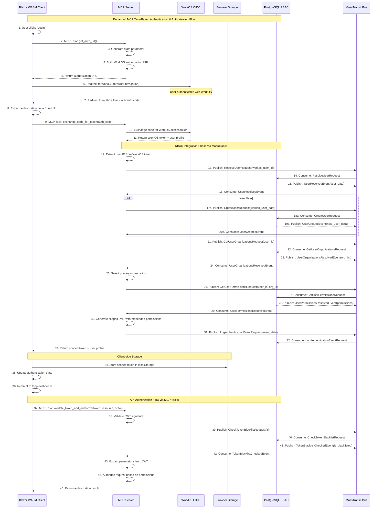

# Nyssa RBAC Integration Implementation Task

## Task Overview

Implement the integration between the existing WorkOS OIDC authentication system and the PostgreSQL RBAC database within the MCP server architecture using MassTransit as the message bus. Transform basic authentication into a permission-based authorization system with embedded permissions in JWT tokens.

## Current System State

### Existing Components
- **WorkOS OIDC Authentication**: Fully functional OAuth 2.0 flow with authorization code exchange
- **PostgreSQL RBAC Database**: Complete schema with tables, functions, and views for permission management
- **MCP Server**: Basic token exchange with WorkOS via MCP tasks
- **Blazor WASM Client**: Authentication state management and UI
- **MassTransit**: Message bus for inter-service communication

### Database Schema Available
- `authz.users` - User accounts with external_id linking to WorkOS
- `authz.organizations` - Hierarchical organization structure using LTREE
- `authz.organization_memberships` - User-organization relationships
- `authz.roles` - Organization-specific roles with inheritance
- `authz.permissions` - System-wide permission definitions
- `authz.role_permissions` - Role-permission mappings
- `authz.user_roles` - User-role assignments within organizations
- `authz.token_blacklist` - JWT revocation tracking
- `authz.audit_events` - Immutable audit logging

### Key Database Functions Available
- `authz.resolve_user_permissions(user_id, org_id, include_inherited)` - Get all user permissions
- `authz.check_user_permission(user_id, org_id, permission)` - Check specific permission
- `authz.blacklist_token(jti, reason)` - Revoke JWT token
- `authz.is_token_blacklisted(jti)` - Check if token is revoked
- `authz.log_audit_event(user_id, event_type, details, category, source, ip_address)` - Log events

## Intended System State

### MCP Task-Based Architecture
The current HTTP endpoint-based flow should be transformed to use MCP tasks and MassTransit messaging:

1. **WorkOS Authentication** (existing) → Get basic user identity
2. **RBAC User Resolution** (new) → Link WorkOS user to RBAC user via MCP task
3. **Permission Resolution** (new) → Query user permissions via MassTransit message
4. **Scoped Token Generation** (new) → Create JWT with embedded permissions
5. **Audit Logging** (new) → Log authentication events via MassTransit

### Token Evolution
- **Authorization Code**: Temporary code from WorkOS (unchanged)
- **WorkOS Access Token**: Intermediate token with basic user info (unchanged)
- **Scoped JWT Token**: New final token with embedded RBAC permissions

### Scoped JWT Structure
```json
{
  "iss": "nyssa-mcp-server",
  "sub": "workos_user_id",
  "aud": "nyssa-api",
  "exp": 1640995200,
  "iat": 1640991600,
  "jti": "jwt_scoped_123456789",
  "user": {
    "id": "rbac_user_uuid",
    "email": "user@company.com",
    "name": "John Doe"
  },
  "organization": {
    "id": "org_uuid",
    "name": "Engineering Department",
    "path": "company.engineering"
  },
  "permissions": [
    "users:read",
    "users:write",
    "tasks:read",
    "tasks:write",
    "projects:admin"
  ],
  "roles": [
    {
      "id": "role_uuid",
      "name": "Engineering Manager",
      "is_inheritable": true
    }
  ],
  "token_type": "scoped",
  "scope": "org:org_uuid"
}
```

## Complete Implementation Sequence Diagram



## Implementation Requirements

### 1. MCP Server Enhancements

#### New MCP Tasks Required
- **`exchange_code_for_token`**: Enhanced to include RBAC integration
- **`validate_token_and_authorize`**: Token validation and permission checking
- **`revoke_token`**: Token blacklisting via MassTransit
- **`get_user_permissions`**: Direct permission querying
- **`get_user_organizations`**: Organization resolution

#### New MassTransit Messages Required
- **Authentication Messages**:
  - `ResolveUserRequest/Response`
  - `CreateUserRequest/Response`
  - `GetUserOrganizationsRequest/Response`
  - `GetUserPermissionsRequest/Response`
  - `LogAuthenticationEventRequest`

- **Authorization Messages**:
  - `CheckTokenBlacklistRequest/Response`
  - `BlacklistTokenRequest`
  - `ValidatePermissionRequest/Response`

#### New Services Required
- **RbacMessageHandlers**: MassTransit consumers for RBAC operations
- **JwtService**: JWT token generation and validation
- **Enhanced AuthenticationTools**: MCP task implementations
- **MessagePublishers**: MassTransit publishers for async operations

#### New Models Required
- **RbacUser**: Internal user representation
- **UserPermission**: Permission data structure
- **ScopedToken**: JWT payload structure
- **OrganizationInfo**: Organization data
- **RoleInfo**: Role data
- **MassTransit Messages**: Request/response/event models

### 2. MassTransit Configuration

#### Bus Configuration
- **RabbitMQ/In-Memory**: Configure message bus transport
- **Message Routing**: Define message routing and queues
- **Retry Policies**: Configure retry logic for database operations
- **Circuit Breaker**: Implement circuit breaker for database failures
- **Message Serialization**: JSON serialization for all messages

#### Consumer Configuration
- **Concurrent Consumers**: Configure parallel message processing
- **Prefetch Count**: Optimize message prefetching
- **Error Handling**: Dead letter queues for failed messages
- **Health Checks**: Monitor consumer health

### 3. Database Integration via MassTransit

#### Message Handlers
- **UserResolutionHandler**: Handle user lookup and creation
- **PermissionResolutionHandler**: Handle permission queries
- **OrganizationResolutionHandler**: Handle organization queries
- **TokenManagementHandler**: Handle token blacklisting
- **AuditLoggingHandler**: Handle audit event logging

#### Async Database Operations
- **User Resolution**: Async user lookup by external_id
- **Permission Resolution**: Async permission queries with inheritance
- **Organization Resolution**: Async organization hierarchy queries
- **Token Operations**: Async token blacklisting and validation
- **Audit Logging**: Async audit event persistence

### 4. MCP Task Authorization

#### Authorization Flow
1. **Token Extraction**: Parse JWT from MCP task parameters
2. **Token Validation**: Verify signature and expiration via MassTransit
3. **Blacklist Check**: Ensure token isn't revoked via message
4. **Permission Extraction**: Parse permissions from JWT claims
5. **Request Authorization**: Check required permissions
6. **Response**: Allow or deny based on permissions

#### Permission Checking via MCP Tasks
- **Resource-based**: `resource:action` format (e.g., `users:read`)
- **Wildcard Support**: Handle permission patterns
- **Role-based**: Support role-based access control
- **Organization-scoped**: Respect organization boundaries

### 5. Error Handling

#### MassTransit Error Handling
- **Message Retry**: Retry failed database operations
- **Dead Letter Queues**: Handle permanently failed messages
- **Circuit Breaker**: Prevent cascade failures
- **Error Logging**: Log all message processing errors

#### MCP Task Error Handling
- **Authentication Errors**: Handle new WorkOS users
- **No Organizations**: Handle users without org access
- **No Permissions**: Handle users with no permissions
- **Database Errors**: Graceful handling of DB failures via messages

### 6. Security Considerations

#### Token Security
- **Secure Signing**: Use strong JWT secret keys
- **Token Expiration**: Implement proper expiration handling
- **Token Revocation**: Support immediate token blacklisting via messages
- **Audit Trail**: Log all authentication and authorization events

#### Message Security
- **Message Encryption**: Encrypt sensitive message payloads
- **Message Authentication**: Verify message integrity
- **Access Control**: Control who can publish/consume messages
- **Audit Logging**: Log all message processing events

## Success Criteria

### Functional Requirements
- ✅ WorkOS authentication flow remains unchanged
- ✅ RBAC integration adds permission-based authorization via MassTransit
- ✅ Scoped JWT tokens contain embedded permissions
- ✅ MCP tasks enforce permission-based access control
- ✅ Token revocation works immediately via messages
- ✅ Audit logging captures all events via MassTransit

### Performance Requirements
- ✅ Token validation < 5ms (using embedded permissions)
- ✅ Permission resolution < 100ms (async database queries)
- ✅ Authentication flow < 2 seconds total
- ✅ MCP task authorization < 10ms per request
- ✅ Message processing < 50ms per message

### Scalability Requirements
- ✅ Horizontal scaling via MassTransit consumers
- ✅ Database connection pooling
- ✅ Message queue persistence
- ✅ Load balancing across consumers

### Security Requirements
- ✅ JWT tokens are cryptographically signed
- ✅ Token blacklisting works immediately via messages
- ✅ Permission inheritance is secure
- ✅ Audit trail is immutable
- ✅ Organization isolation is enforced
- ✅ Message security and encryption

## Implementation Priority

### Phase 1: Core MassTransit Integration
1. MassTransit bus configuration
2. Message models and contracts
3. Basic message handlers
4. Enhanced MCP task implementations

### Phase 2: RBAC Message Integration
1. User resolution messages
2. Permission resolution messages
3. Organization resolution messages
4. Token management messages

### Phase 3: Authorization & Security
1. MCP task authorization middleware
2. Token validation and blacklisting
3. Audit logging integration
4. Security hardening and encryption

## File Structure

```
src/nyssa.mcp.server/
├── Models/
│   ├── RbacUser.cs
│   ├── UserPermission.cs
│   ├── ScopedToken.cs
│   ├── OrganizationInfo.cs
│   ├── RoleInfo.cs
│   └── Messages/
│       ├── Authentication/
│       │   ├── ResolveUserRequest.cs
│       │   ├── ResolveUserResponse.cs
│       │   ├── CreateUserRequest.cs
│       │   ├── CreateUserResponse.cs
│       │   ├── GetUserOrganizationsRequest.cs
│       │   ├── GetUserOrganizationsResponse.cs
│       │   ├── GetUserPermissionsRequest.cs
│       │   ├── GetUserPermissionsResponse.cs
│       │   └── LogAuthenticationEventRequest.cs
│       └── Authorization/
│           ├── CheckTokenBlacklistRequest.cs
│           ├── CheckTokenBlacklistResponse.cs
│           ├── BlacklistTokenRequest.cs
│           └── ValidatePermissionRequest.cs
├── Services/
│   ├── RbacMessageHandlers/
│   │   ├── UserResolutionHandler.cs
│   │   ├── PermissionResolutionHandler.cs
│   │   ├── OrganizationResolutionHandler.cs
│   │   ├── TokenManagementHandler.cs
│   │   └── AuditLoggingHandler.cs
│   ├── JwtService.cs
│   ├── MessagePublishers/
│   │   ├── AuthenticationPublisher.cs
│   │   └── AuthorizationPublisher.cs
│   └── Enhanced WorkOSAuthenticationService.cs
├── Tools/
│   └── Enhanced AuthenticationTools.cs
├── Configuration/
│   ├── MassTransitConfiguration.cs
│   └── DatabaseConfiguration.cs
└── Program.cs (updated with MassTransit)
```

## Dependencies Required

### NuGet Packages
- `MassTransit`
- `MassTransit.RabbitMQ` (or `MassTransit.InMemory`)
- `MassTransit.Newtonsoft` (or `MassTransit.SystemTextJson`)
- `Microsoft.IdentityModel.Tokens`
- `System.IdentityModel.Tokens.Jwt`
- `Npgsql`
- `Dapper`

### Configuration
- **Database Connection String**: PostgreSQL RBAC database
- **JWT Secret Key**: For token signing
- **MassTransit Transport**: RabbitMQ or In-Memory
- **Message Queue Settings**: Retry policies, circuit breakers

This implementation will transform the basic authentication system into a comprehensive, secure, and scalable authorization system that leverages MassTransit for reliable message-based communication with the PostgreSQL RBAC database. 